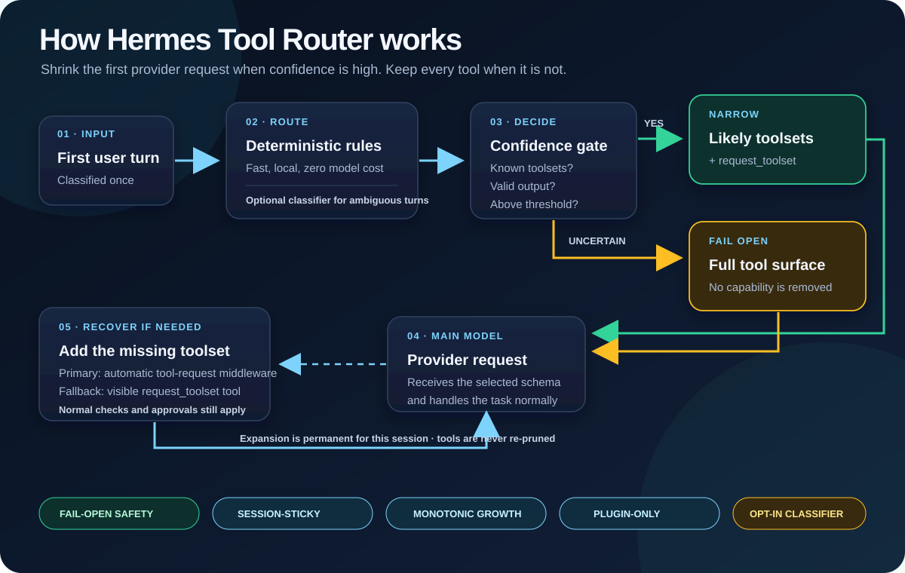

# Hermes Tool Router

A standalone Hermes Agent plugin that reduces prompt token overhead by selecting only the toolsets a turn is likely to need before Hermes builds the prompt and tool schema payload.

It keeps a small recovery tool, `request_toolset`, available so the model can ask for a missing toolset during the turn instead of silently failing.

> **Proof-of-concept warning:** this plugin is experimental. Do not enable it first on your primary Hermes profile. Create a separate test profile, or enable it only on an alternate profile you can reset easily, then move it to daily use only after you have tested your toolset mix and routing behavior.



For a larger visual walkthrough, open [`docs/how-it-works.html`](docs/how-it-works.html).

## What it does

- Runs before turn-context construction through Hermes' `pre_turn_context_build` hook.
- Predicts needed toolsets with deterministic rules first. If no deterministic rule is confident, it can call a small, fast router model to classify the turn.
- Mutates the live agent tool surface for the current turn only.
- Falls back open to the full toolset on uncertainty, errors, long messages, unavailable router credentials, or unsupported hook versions.
- Provides `request_toolset(toolset, reason)` as an escape hatch when the model needs a filtered-out toolset.
- Keeps `pre_llm_call` as a compatibility fallback for older Hermes builds.

## Requirements

- Hermes Agent with plugin support.
- Best with Hermes builds that expose the `pre_turn_context_build` hook.
- Python package `pyyaml` available in the Hermes environment.
- For deterministic-only routing: no model API key is required.
- For full routing behavior on ambiguous/non-obvious requests: a small OpenAI-compatible router model is required, plus `openai` and either `DEEPSEEK_API_KEY` or `OPENROUTER_API_KEY`.

Deterministic routing works without external API keys, but it only covers obvious intent patterns. Without a router model, uncertain turns fail open to the full toolset.

## Dependencies

Minimal runtime:

```bash
pip install -r requirements.txt
```

`pyyaml` is required for configuration loading. `openai` is only needed if you enable LLM-based router calls through DeepSeek or OpenRouter.

Important: the router model should be small and low-latency. It runs before the main model call on turns that deterministic rules cannot classify, so using a large/slow model can erase the token savings with added delay.

## Installation

Recommended setup: install and test in a separate Hermes profile.

```bash
hermes profile create router-test --clone
```

Then install the plugin for that profile's Hermes home. If your profile uses the standard layout, that means:

```bash
mkdir -p ~/.hermes/profiles/router-test/plugins
cp -R hermes-token-router-public ~/.hermes/profiles/router-test/plugins/hermes-token-router
```

Enable the plugin in the test profile config, not your main profile, until you are comfortable with its behavior:

```yaml
plugins:
  enabled:
    - hermes-token-router
```

Run a test session with:

```bash
hermes --profile router-test chat
```

Only after testing should you copy the plugin into your main `~/.hermes/plugins/` directory or enable it globally.

Clone or copy this repository into your Hermes plugins folder under the plugin name `hermes-token-router`:

```bash
mkdir -p ~/.hermes/plugins
cp -R hermes-token-router-public ~/.hermes/plugins/hermes-token-router
```

Enable it in your Hermes config:

```yaml
plugins:
  enabled:
    - hermes-token-router
```

Then edit the plugin's `config.yaml` and enable only the test profile at first.

Example test-profile setup:

```yaml
global:
  enabled: false

profiles:
  router-test:
    enabled: true
    floor_toolsets: [terminal, file, web]
    deterministic_rules_enabled: true
    long_message_decline_chars: 12000
    router_provider: deepseek
    router_model: deepseek-chat
```

Restart Hermes or start a fresh session after changing plugin configuration.

## Configuration

```yaml
global:
  enabled: false
  floor_toolsets: [terminal, file, web]
  deterministic_rules_enabled: true
  confidence_threshold: 0.0
  long_message_decline_chars: 12000
  short_message_bypass_chars: 0
  router_provider: deepseek
  router_model: deepseek-chat

profiles:
  router-test:
    enabled: true
```

Key settings:

- `enabled`: opt-in switch. Leave global disabled unless you intentionally want the router everywhere.
- `floor_toolsets`: toolsets always retained after routing. Use `[]` for aggressive reduction.
- `deterministic_rules_enabled`: fast regex-based routes for common intents.
- `long_message_decline_chars`: bypass routing for complex long turns.
- `short_message_bypass_chars`: optional bypass for very short messages.
- `router_provider`: `deepseek` or `openrouter`.
- `router_model`: model name for the selected provider.

## Provider notes

Supported direct router providers:

- `deepseek` via `DEEPSEEK_API_KEY`, default sample `deepseek-chat`.
- `openrouter` via `OPENROUTER_API_KEY`, for example `meta-llama/llama-3.1-8b-instruct`.

`openai-codex` is intentionally disabled in the plugin because Codex uses a Responses API transport, not standard Chat Completions.

Recommended router model profile:

- Small instruction model, roughly 7B-12B class or equivalent fast hosted model.
- Strong JSON-following behavior.
- Low latency, ideally sub-second for a short classification prompt.
- Cheap enough to run on many turns.

Examples:

- `deepseek-chat` through DeepSeek, simple default and broadly available.
- `meta-llama/llama-3.1-8b-instruct` through OpenRouter or another fast OpenAI-compatible provider.
- A local OpenAI-compatible endpoint can be added by extending `_get_router_client()`.

## Privacy and data egress

When deterministic rules are enough, no user prompt text leaves the local Hermes process.

If deterministic rules cannot classify the turn and router model credentials are available, the plugin sends up to the first 1,500 characters of the user message plus the available toolset list to the configured router provider. For sensitive environments, either:

- keep `deterministic_rules_enabled: true` and avoid configuring router provider credentials, so uncertain turns fall back to the full local toolset;
- set a high `confidence_threshold` and conservative `floor_toolsets`; or
- disable the plugin for profiles that handle sensitive prompts.

## Safety model

The plugin is designed to fail open:

- Config disabled: no changes.
- No router credentials: full toolset fallback unless deterministic rules already made a confident route.
- Router timeout or invalid JSON: full toolset fallback.
- Unknown toolset: full toolset fallback.
- Missing tool detected after narrowing: attempts to expand the owning toolset.

The only intentionally aggressive mode is `floor_toolsets: []`, which can leave only `request_toolset` for plain-answer turns.

## Development and tests

Run the smoke tests from the repository root:

```bash
python3 -m py_compile *.py tests/*.py
python3 tests/smoke_hardening.py
python3 -m pytest tests -q
```

The tests use a fake Hermes tool registry and do not require live API credentials.

## Repository contents

- `__init__.py` — plugin registration, hooks, and recovery handler.
- `config.py` — config loading and profile resolution.
- `policy.py` — deterministic and LLM-based toolset prediction.
- `tools.py` — registry resolution, filtering, expansion, and recovery tool schema.
- `state.py` — agent-scoped router state.
- `config.yaml` — safe disabled-by-default sample config.
- `tests/` — smoke tests for routing and recovery.
- `docs/pre_turn_context_build_hook.md` — design notes for the required core hook.

## License

MIT. See `LICENSE`.
